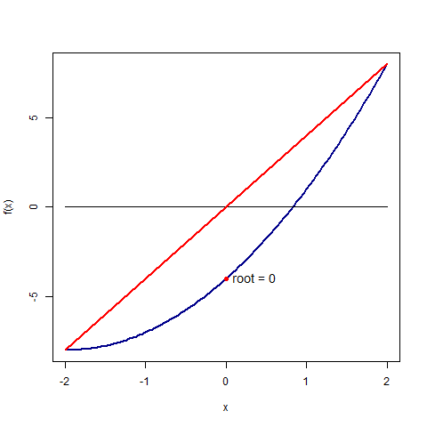

## Mini R Programs

This repo is a collection of useful scripts in R that I had made during my time at the Banaras Hindu University. This repo is not meant to be a complete R library but rather a collection of scripts for more minor works from Scratch.

## About Me

I am a Research Scholar at the Indian Institute of Technology, Guwahati, in the 
Department of Mathematics, earlier I had pursued my Masters in Statistics and 
Computing at Banaras Hindu University at the Centre for Interdisciplinary 
Mathematical Sciences (CIMS). Currently, my research is focused on the 
Statistical Machine Learning and its applications.  

:warning: I am looking for collaborators specifically for writing a Probabilistic 
Programming Language using JAX. If you are interested in this, don't hesitate to get in touch with me. 

## List of scripts

 

*Root of f(x) = x^2+4*x - 4 using Bisection Method*

1. :pushpin: **Sorting**  
   - :round_pushpin: *Quick Sort*  &nbsp; [PDF](Sorting/QuickSort/quicksort.pdf)  &emsp; [Source](Sorting/QuickSort/quicksort.R)  
   - :round_pushpin: *Merge Sort*  &nbsp; [PDF](Sorting/Merge%20Sort/mergesort.pdf)  &emsp; [Source](Sorting/Merge%20Sort/mergesort.R)
    - :round_pushpin: *Bubble Sort*  &nbsp; [PDF](Sorting/Bubble%20Sort/bubblesort.pdf)  &emsp; [Source](Sorting/Bubble%20Sort/bubblesort.R)
    - :round_pushpin: *Selection Sort*  &nbsp; [PDF](Sorting/Selection%20Sort/selectionsort.pdf)  &emsp; [Source](Sorting/Selection%20Sort/selectionsort.R)
    - :round_pushpin: *Insertion Sort*  &nbsp; [PDF](Sorting/Insertion%20Sort/insertionsort.pdf)  &emsp; [Source](Sorting/Insertion%20Sort/insertionsort.R)
    - :round_pushpin: *Shell Sort*  &nbsp; [PDF](Sorting/Shell%20Sort/shellsort.pdf)  &emsp; [Source](Sorting/Shell%20Sort/shellsort.R)
2. :pushpin: **Searching**  
   - :round_pushpin: *Binary Search*  &nbsp; [PDF](Searching/BinarySearch/binarysearch.pdf)  &emsp; [Source](Searching/BinarySearch/binarysearch.R)
   - :round_pushpin: *Interpolation Search*  &nbsp; [PDF](Searching/InterpolationSearch/interpolationsearch.pdf)  &emsp; [Source](Searching/InterpolationSearch/interpolationsearch.R)
   - :round_pushpin: *Jump Search*  &nbsp; [PDF](Searching/JumpSearch/jumpsearch.pdf)  &emsp; [Source](Searching/JumpSearch/jumpsearch.R)
   - :round_pushpin: *Linear Search*  &nbsp; [PDF](Searching/LinearSearch/linearsearch.pdf)  &emsp; [Source](Searching/LinearSearch/linearsearch.R)

7. :pushpin: **Bayesian**
    - :round_pushpin: *Computing Integral with Monte Carlo*  &nbsp; [PDF](Bayesian/MonteCarlo/montecarlo.pdf)  &emsp; [Source](Bayesian/MonteCarlo/montecarlo.Rmd)
    - :round_pushpin: *Rejection Sampling* &nbsp; [PDF](Bayesian/RejectionSampling/rejectionsampling.pdf)  &emsp; [Source](Bayesian/RejectionSampling/rejectionsampling.Rmd)
    - :round_pushpin: *Highest Posterior density Interval*  &nbsp; [PDF](Bayesian/HighestPosteriorDensityInterval/highestposteriordensityinterval.pdf)  

5. :pushpin: **Machine Learning**
    - :round_pushpin: *Linear Regression*  &nbsp; [PDF](Machine%20Learning/Regression/Linear%20Regression/linearregression.pdf) &emsp; [Source](Machine%20Learning/Regression/Linear%20Regression/linearregression.R)
    - :round_pushpin: *Ridge Regression*  &nbsp; [PDF](Machine%20Learning/Regression/Ridge%20Regression/ridgeregression.pdf) &emsp; [Source](Machine%20Learning/Regression/Ridge%20Regression/ridgeregression.R)

8. :pushpin: **Statistical Algorithm**
    - :round_pushpin: *Naive Density Estimate*  &nbsp; [PDF](Statistics\naive.pdf)
    - :round_pushpin: *Kernel Density Estimate*  &nbsp; [PDF](Statistics\kernel.pdf)
    - :round_pushpin: *GQ,BPG,Whites and KB Test*  &nbsp; [PDF](Statistics\gq.pdf)
    - :round_pushpin: *Dublin-Watson Test* &nbsp; [PDF](Statistics\dublin.pdf)
    - :round_pushpin: *EM Estimate of mixture models*  &nbsp; [PDF](Statistics\mixture.pdf)
    - :round-pushpin: *MLE of weibull distribution*  &nbsp; [PDF](Statistics\weibull.pdf)

10. :pushpin: **Linear Algebra**
    - :round_pushpin: *LU Matrix Factorization*  &nbsp; [PDF](Linear%20Algebra/LU/lu.pdf)  &emsp; [Source](LinearAlgebra/LU/lu.R)
    - :round_pushpin: *RREF using Gauss Elimination*  &nbsp; [PDF](Linear%20Algebra/RREF/RREF.pdf)  &emsp; [Source](LinearAlgebra/RREF/RREF.R)
    - :round_pushpin: *Cholesky Decomposition*  &nbsp; [PDF](Linear%20Algebra/Cholesky/cholesky.pdf)  &emsp; [Source](LinearAlgebra/Cholesky/cholesky.R)
    - :round_pushpin: **Determinant** &nbsp; [PDF](Linear%20Algebra/Determinant/determinant.pdf)  &emsp; [Source](Linear%20Algebra/Determinant/determinant.R)
    - :round_pushpin: **Inverse** &nbsp; [PDF](Linear%20Algebra/Inverse/inverse.pdf)  &emsp; [Source](Linear%20Algebra/Inverse/inverse.R)
    - :round_pushpin: **Eigenvalues and Eigenvectors using Power Maethod** &nbsp; [PDF](Linear%20Algebra/Eigenvalues%20and%20Eigenvectors/powermethod.pdf)  &emsp; [Source](Linear%20Algebra/Eigenvalues%20and%20Eigenvectors/powermethod.R)
    - :round_pushpin: **Eigenvalue and Eigenvector using JACOBI method** &nbsp; [PDF](Linear%20Algebra/Eigenvalues%20and%20Eigenvectors/jacobimethod.pdf)  

11. :pushpin: **Mathematics**
    - :round_pushpin: *Bisection*  &nbsp; [PDF](Mathematics/bisection.pdf)  &emsp; [Source](Mathematics/bisection.R)
    

### *Credit Card Fraud Detection using Random Forest using Julia from Scratch*  &nbsp; [PDF](Credit%20Card%20Fraud%20Detection%20Using%20Random%20Forest.pdf)

### *A simple coin tossing Experiments*  &nbsp; [PDF](coin.pdf)  

### *Cross Validation* &nbsp; [PDF](cv.pdf) 

### *Infimum of Inverse Gamma Distribution*  &nbsp; [PDF](inversegamma.pdf)  

### **Archived** &nbsp; [PDF](archieve.pdf) &nbsp; [PDF](archieve2.pdf)
